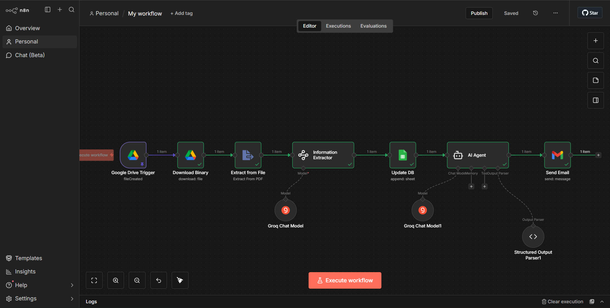
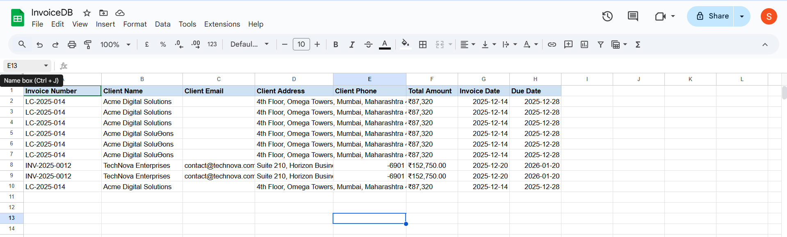
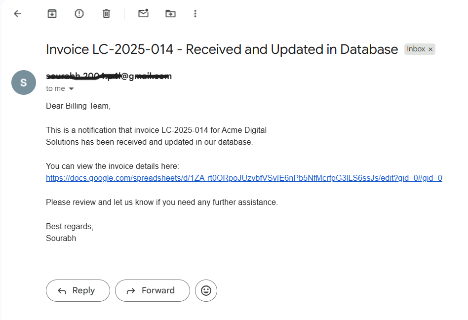

# ai-automation-n8n-INVOICE
AI Invoice Automation is a production-ready workflow built with n8n that automatically detects invoice PDFs from Google Drive, extracts and processes invoice data using an AI agent, stores it in Google Sheets, and sends professional email notifications to the billing team, demonstrating real-world automation engineering skills.

# AI Invoice Automation (n8n)

This project is an AI-powered automation built using n8n.

## Problem Statement
Manual invoice processing is time-consuming, error-prone, and inefficient for billing teams. Tracking invoices, extracting data, updating records, and sending notifications often requires repetitive manual effort.

## Solution
This n8n-powered AI automation:
- Detects new invoice PDFs uploaded to Google Drive
- Extracts structured invoice data using an AI Agent
- Stores invoice details in Google Sheets
- Generates professional billing emails using LLMs
- Sends automated notifications to the billing team

## What it does
- Detects invoice PDFs from Google Drive
- Extracts invoice data using an AI Agent
- Stores structured data in Google Sheets
- Sends professional email notifications to the billing team

## Tech Stack
- n8n (local & deployable)
- Groq / LLM-based AI Agent
- Google Drive API
- Google Sheets API
- Gmail API

## How to use
1. Import `invoice-ai-agent.json` into n8n
2. Configure Google & LLM credentials
3. Activate the workflow

## Use case
Real-world finance & billing automation for startups and enterprises.

## Workflow Overview

## Google Sheet Update

## Email Notification

## 🎥 Demo Video
Watch a 2-minute end-to-end walkthrough of the AI Invoice Automation workflow:  
👉 https://www.loom.com/share/a198a0431aa644869a75305caebd1280

